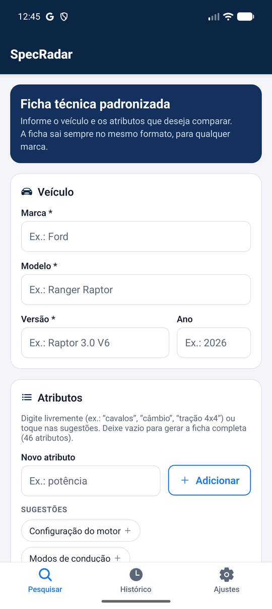
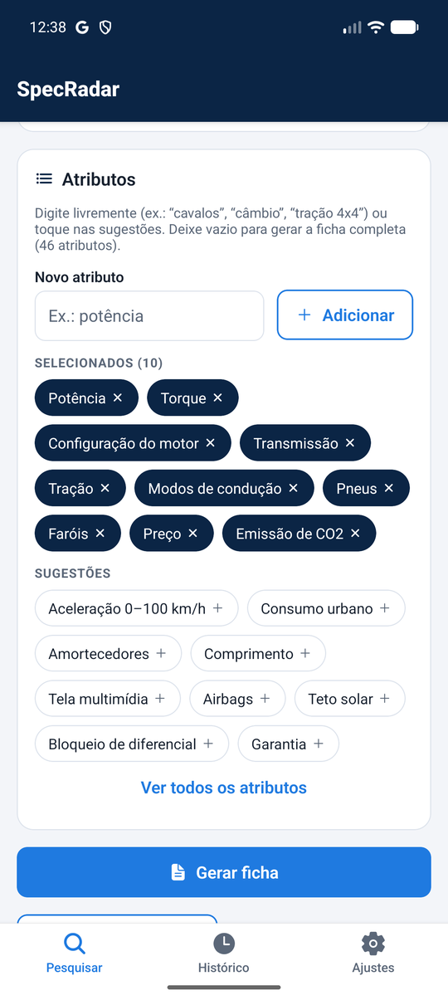
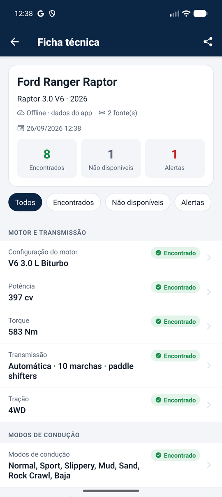
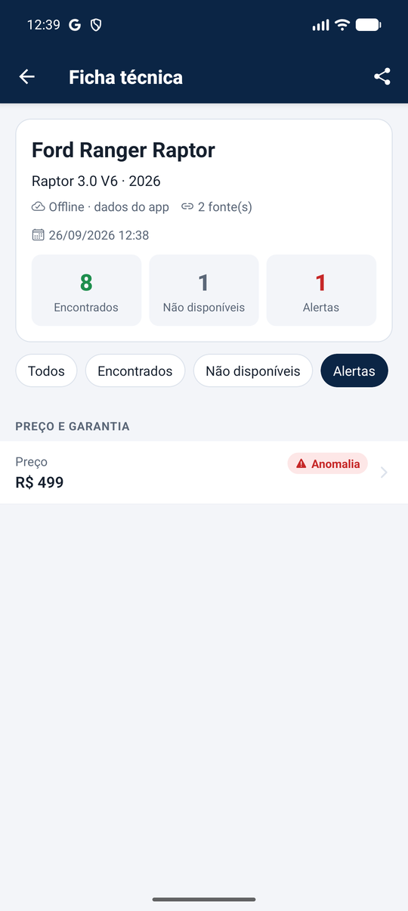
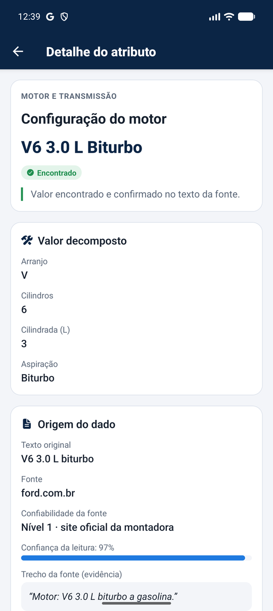
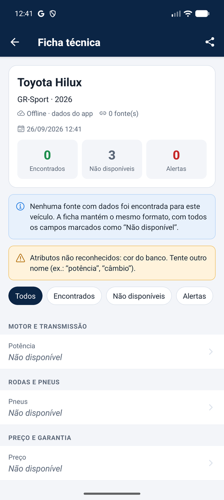
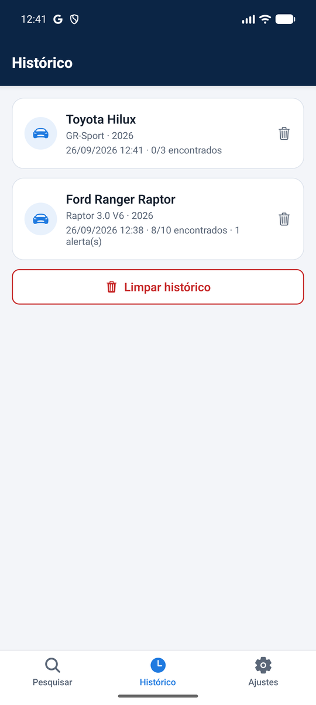
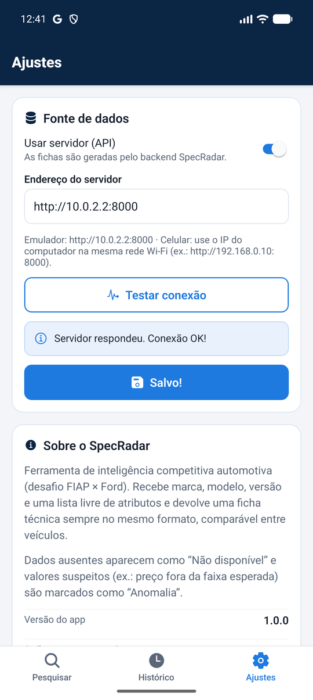

# SpecRadar — Inteligência Competitiva Automotiva (Mobile)

> Desafio **FIAP × Ford** · Disciplina **Mobile Development and IoT**
> App Android (APK) + backend em Python.

O SpecRadar recebe uma entrada simples — **marca, modelo, versão e uma lista livre de
atributos** — e devolve uma **ficha técnica padronizada**: sempre no mesmo formato,
agrupada por seção, com os dados que não existem marcados como **“Não disponível”**.

A solução foi validada com a **Ford Ranger Raptor**, conforme pedido no desafio.

---

## Sumário

- [Funcionalidades](#funcionalidades)
- [Telas](#telas)
- [Identidade visual](#identidade-visual)
- [Arquitetura](#arquitetura)
- [Como rodar](#como-rodar)
- [Gerar o APK](#gerar-o-apk)
- [Validação — Ford Ranger Raptor](#validação--ford-ranger-raptor)
- [Estrutura de pastas](#estrutura-de-pastas)
- [Tecnologias](#tecnologias)
- [Equipe](#equipe)

---

## Funcionalidades

| Requisito do desafio | Como o app atende |
|---|---|
| Entrada: marca, modelo e versão | Formulário com validação (campos obrigatórios e ano opcional) |
| Lista **livre** de atributos | Campo de texto livre + chips de sugestão. Entende sinônimos em português (“cavalos” → Potência, “câmbio” → Transmissão, “tração 4x4” → Tração) |
| Saída: lista de especificações | Ficha agrupada por seção (Motor, Desempenho, Rodas, Preço...) |
| Formato sempre igual | A ficha segue a ordem fixa da taxonomia (46 atributos). Um veículo sem dados recebe **a mesma ficha**, com todos os campos “Não disponível” |
| Informação inexistente explícita | Campos sem dado aparecem como **“Não disponível”** e têm filtro próprio |
| Dados claros e comparáveis | Unidades padronizadas (cv, Nm, km/h, mm, R$...), status colorido por campo, resumo “encontrados / não disponíveis / alertas” |

Outros recursos:

- **Detalhe de cada atributo:** fonte, nível de confiabilidade, % de confiança e o trecho
  do texto original usado como evidência (a ficha é auditável).
- **Alertas automáticos:** valores fora da faixa esperada viram **Anomalia** (ex.: preço de
  R$ 499 para uma picape).
- **Histórico** salvo no aparelho (AsyncStorage) — funciona sem internet.
- **Compartilhar** a ficha em texto (WhatsApp, e-mail...).
- **Modo offline + servidor:** o app funciona sozinho com dados embarcados e também pode
  consultar o backend. Se o servidor cair, o app usa os dados offline e avisa o usuário.

## Telas

| Pesquisar | Exemplo preenchido | Ficha técnica |
|:---:|:---:|:---:|
|  |  |  |

| Ficha — alertas | Detalhe (anomalia) | Detalhe (evidência) |
|:---:|:---:|:---:|
|  |  |  |

| Veículo sem dados | Histórico | Ajustes |
|:---:|:---:|:---:|
|  |  |  |

## Identidade visual

Todas as cores, tamanhos de fonte e espaçamentos ficam em
[`mobile/src/theme.ts`](mobile/src/theme.ts) e os componentes reutilizáveis em
[`mobile/src/components`](mobile/src/components) — assim todas as telas seguem o mesmo padrão.

| Elemento | Valor |
|---|---|
| Cor principal (marca) | `#0B2545` azul-marinho — cabeçalhos, ícone e splash |
| Cor de ação | `#1F7AE0` azul — botões, abas ativas, links |
| Fundo / cartões | `#F3F5F9` / `#FFFFFF` com borda `#DDE3EC` |
| Status | Encontrado (verde) · Não disponível (cinza) · Anomalia (vermelho) · Conflito (roxo) · Baixa confiança (âmbar) |
| Tipografia | Fonte do sistema; escala título 22 · subtítulo 17 · corpo 15 · legenda 13 |
| Ícones | Ionicons (`@expo/vector-icons`) |
| Ícone do app | Radar em azul sobre fundo marinho (ícone adaptativo no Android) |

## Arquitetura

```
┌──────────────────────── App (Expo / React Native) ────────────────────────┐
│  Pesquisar ──► services/api.ts ──┬──► Backend FastAPI  POST /api/spec     │
│                                  │        (quando "Usar servidor" ligado) │
│                                  └──► services/offline.ts                 │
│                                           (dados embarcados / fallback)   │
│  Ficha técnica ◄── histórico salvo (AsyncStorage) ──► Detalhe do atributo │
└───────────────────────────────────────────────────────────────────────────┘

Backend (Python):  taxonomia (YAML) → extração com evidência → normalização
                   → reconciliação (anomalias/conflitos) → ficha padronizada
```

- **Backend** (`backend/`): API FastAPI com os endpoints `GET /api/health`,
  `GET /api/taxonomy` e `POST /api/spec`. Sem chaves de API ele roda em **modo
  demonstração** com os dados da Ranger Raptor. Com `ANTHROPIC_API_KEY` e
  `SEARCH_API_KEY` configuradas (ver `backend/.env.example`), faz a busca real em sites
  permitidos e usa IA só para **ler** os valores — cada valor precisa citar o trecho da
  página, e esse trecho é conferido pelo código (se não existir, o valor é descartado).
- **App** (`mobile/`): usa os mesmos dados do backend exportados em JSON
  (`mobile/src/data`), então o APK funciona mesmo sem servidor.

## Como rodar

### Pré-requisitos

- Node.js 20+ e npm
- Python 3.12+ (apenas para o backend)
- Android Studio com emulador **ou** celular Android com o app **Expo Go**

### Backend (opcional)

```bash
cd backend
python -m venv .venv
.venv\Scripts\activate          # Linux/macOS: source .venv/bin/activate
pip install -e ".[dev]"
uvicorn specradar.api.main:app --host 0.0.0.0 --port 8000
```

Documentação interativa: <http://localhost:8000/docs>. Testes: `pytest -q`.

### App

```bash
cd mobile
npm install
npx expo start          # depois: "a" abre no emulador, ou leia o QR code com o Expo Go
```

Para usar o backend no app: aba **Ajustes** → ligar **Usar servidor (API)** → informar o
endereço → **Testar conexão** → **Salvar**.

- Emulador Android: `http://10.0.2.2:8000`
- Celular físico: `http://<IP-do-computador>:8000` (mesma rede Wi-Fi)

## Gerar o APK

### Opção 1 — EAS Build (nuvem, recomendado)

```bash
npm install -g eas-cli
cd mobile
eas login
eas build -p android --profile preview
```

O perfil `preview` do [`eas.json`](mobile/eas.json) gera um **APK** instalável. Ao final,
o EAS mostra um link/QR code para baixar o arquivo.

### Opção 2 — Build local (Android Studio instalado)

```bash
cd mobile
npx expo prebuild -p android
cd android
gradlew assembleRelease
# APK em: android/app/build/outputs/apk/release/app-release.apk
```

> Dicas para o build local no Windows:
> - Se falhar por caminho muito longo, copie a pasta `mobile/` para um caminho curto
>   (ex.: `C:\srbuild\mobile`) e rode os comandos lá.
> - Se aparecer `OutOfMemoryError: Metaspace`, edite `android/gradle.properties`:
>   `org.gradle.jvmargs=-Xmx4096m -XX:MaxMetaspaceSize=1024m`.

### Instalar

O APK da versão 1.0.0 já gerado fica em `release/SpecRadar-v1.0.0.apk` (também publicado
na página de *Releases* do repositório). Ele foi testado no emulador Android (Pixel 9 Pro)
e roda em celulares ARM 64-bit, que são praticamente todos os aparelhos atuais.

- **Emulador:** arraste o `.apk` para a janela do emulador (ou `adb install app-release.apk`).
- **Celular:** envie o `.apk` para o aparelho, abra e permita “instalar apps de fontes
  desconhecidas”.

## Validação — Ford Ranger Raptor

Na aba Pesquisar, toque em **“Exemplo: Raptor”** e depois em **“Gerar ficha”**.

| Atributo | Resultado no app | Status |
|---|---|---|
| Configuração do motor | V6 3.0 L Biturbo | Encontrado |
| Potência | 397 cv | Encontrado |
| Torque | 583 Nm | Encontrado |
| Transmissão | Automática · 10 marchas · paddle shifters | Encontrado |
| Tração | 4WD | Encontrado |
| Modos de condução | Normal, Sport, Slippery, Mud, Sand, Rock Crawl, Baja | Encontrado |
| Pneus | 285/70 R17 | Encontrado |
| Faróis | Matrix LED | Encontrado |
| Preço | R$ 499 | **Anomalia** (valor impossível para a categoria) |
| Emissão de CO2 | Não disponível | Não disponível |

Pontos que mostram que a solução funciona:

1. **Formato fixo:** pesquisar qualquer outro veículo gera a mesma ficha, na mesma ordem.
2. **Ausência explícita:** o que não foi encontrado aparece como “Não disponível”.
3. **Sem invenção:** uma das fontes de demonstração informa torque de 600 Nm sem o texto existir na
   página — o valor é descartado e fica o oficial da Ford (583 Nm).
4. **Alerta automático:** o preço de R$ 499 é marcado como anomalia.

O backend tem um teste automatizado dessa validação (`backend/tests/golden`).

## Estrutura de pastas

```
.
├── mobile/                     App Expo (React Native + TypeScript)
│   ├── app.json · eas.json     Configuração do app e do build do APK
│   ├── assets/                 Ícone, ícone adaptativo e splash
│   └── src/
│       ├── app/                Telas (Expo Router)
│       │   ├── (tabs)/         Pesquisar · Histórico · Ajustes
│       │   ├── ficha.tsx       Ficha técnica
│       │   └── atributo.tsx    Detalhe do atributo
│       ├── components/         Componentes reutilizáveis
│       ├── services/           API, modo offline e armazenamento local
│       ├── data/               Taxonomia + ficha da Raptor (JSON)
│       ├── utils/format.ts     Formatação de valores e datas
│       ├── theme.ts            Identidade visual
│       └── types.ts            Tipos (contrato da API)
├── backend/                    API FastAPI (Python)
│   ├── src/specradar/          Extração, normalização, reconciliação e API
│   ├── taxonomy/               Atributos, sinônimos e fontes (YAML)
│   ├── examples/ranger_raptor/ Dados de demonstração
│   ├── scripts/                Exporta os dados para o app
│   └── tests/                  Testes unitários + teste da Raptor
└── docs/screenshots/           Capturas das telas
```

## Tecnologias

**Mobile:** Expo SDK 57 · React Native 0.86 · TypeScript · Expo Router (abas + pilha) ·
AsyncStorage · Ionicons · EAS Build.

**Backend:** Python · FastAPI · Pydantic · PyYAML · pytest · (opcional) Claude API para
extração e Google Custom Search para achar as fontes.

## Equipe

| Nome | RM |
|---|---|
| Arthur Menezes | 562950 |
| Caio Rasuck | 93645 |
